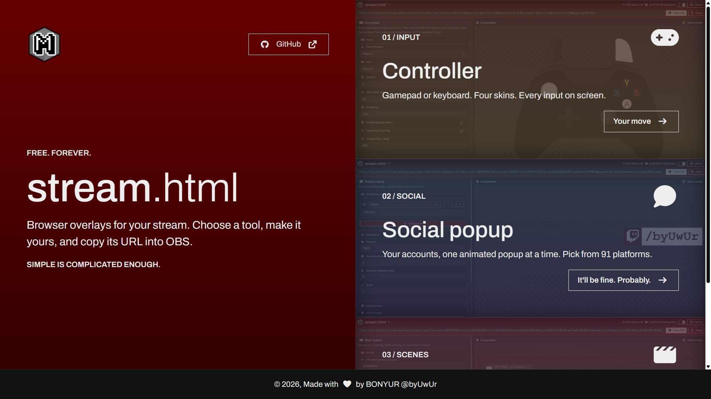
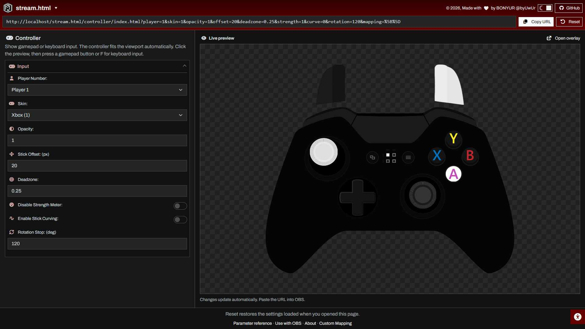
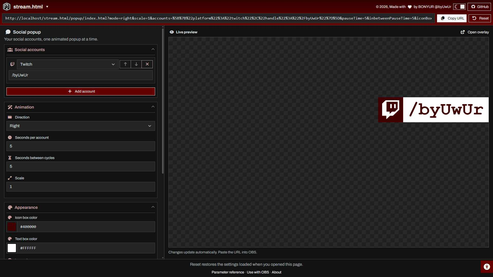
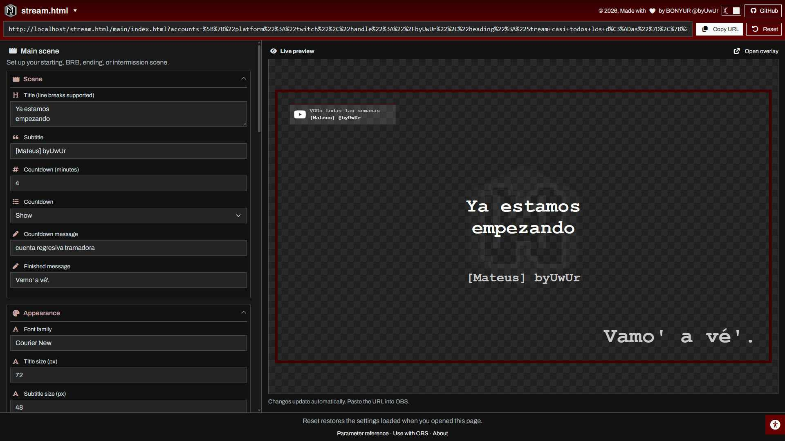

# byuwur/stream.html



Free stream overlays, plus the presets and assets I use for streaming. Free. Forever.

Open a configurator, adjust the settings, and copy its URL into an OBS Browser source. No account, package install, or build step.

[Open stream.html](https://byuwur.github.io/stream.html/) · [Configurator demo](https://byuwur.github.io/stream.html/configurator.html)

## HTML overlays

| Tool       | What it does                                                                                                     | Configure online                                                    | Local entry point       |
| ---------- | ---------------------------------------------------------------------------------------------------------------- | ------------------------------------------------------------------- | ----------------------- |
| Controller | Shows gamepad or keyboard input with Xbox, PlayStation, fight-stick, and GameCube skins.                         | [Controller form](https://byuwur.github.io/stream.html/controller/) | `controller/index.html` |
| Popup      | Cycles through social handles with animated icons and configurable colors, timing, direction, and scale.         | [Popup form](https://byuwur.github.io/stream.html/popup/)           | `popup/index.html`      |
| Main scene | Starting, BRB, ending, and intermission scenes with a title, countdown, branding, social accounts, and schedule. | [Main scene form](https://byuwur.github.io/stream.html/main/)       | `main/index.html`       |

Each tool uses the same `index.html` for its configurator and overlay, with separate markup and styles for each mode. The homepage lets you choose a tool; the forms provide collapsible sections, live previews, and links to parameter help.

## Use with OBS

1. Open a configurator from the table above.
2. Replace my example branding, text, handles, and media with yours.
3. Adjust settings and check the live preview.
4. Click **Copy URL**.
5. Add an OBS **Browser** source and paste the URL.

Use **1920 × 1080** for the main scene. Size controller and popup sources for your layout. The preview scales the actual overlay without changing its OBS dimensions.

Settings sections start expanded and can collapse independently using their headings. Switches and their labels are clickable. Color defaults and Pickr use HEX, with eight digits for transparency (`#RRGGBBAA`). Theme preference is saved locally; accessibility controls offer text, motion, font, spacing, contrast, and color adjustments.

### Downloaded use

Download and extract the repository, then open a tool's `index.html`. Each tool has one HTML, one JavaScript, and one CSS file, plus its artwork. Keep the whole tool folder and the parent `configurator.js` and `configurator.css`; one HTML file alone is not a complete bundle.

Local configurators generate `file:///.../{tool}/index.html?...` URLs. Paste the complete URL into OBS with **Local file** unchecked. The folder must stay at that path on the viewing computer. Basic overlays do not need a web server.

Configurators and animated overlays need internet for CDN libraries, fonts, the default logo, and any remote media. The Controller renderer uses local artwork and native JavaScript. Local media paths must exist on the viewing computer.

| Part                | Dependencies                                                           |
| ------------------- | ---------------------------------------------------------------------- |
| Shared configurator | jQuery, Bootstrap, Pickr, Font Awesome, and SPA common styles/helpers. |
| Controller renderer | Native JavaScript and its controller artwork.                          |
| Popup renderer      | Native DOM APIs, GSAP, MorphSVG, and Font Awesome brand icons.         |
| Main renderer       | Native DOM APIs, GSAP, and Font Awesome brand icons.                   |

CDN imports use `byuwur/spa.php@v19.4` through jsDelivr, with separate script tags in dependency order. jQuery belongs to the configurator; resource rendering does not use it.

### Editing an existing URL

- Bare folder and `index.html` URLs open the configurator; URLs with query settings and no hash render the overlay. No `overlay` flag is needed.
- To edit an existing overlay URL, append `#configure`, keeping its settings. Help hashes also open the configurator.
- Both modes use the same `index.html`; no redirect is needed. Replace old `controller.html`, `popup.html`, or `main.html` filenames in OBS URLs with `index.html`, keeping their parameters.
- **Reset** restores the settings loaded when the form opened. Reopen the bare folder URL for bundled defaults.

Settings live in the URL, with no upload or account storage. Use public display information only. The URL fragment opens the editor and help; it is omitted from generated overlay URLs.

Valid URL values override each resource's defaults; missing or invalid values keep them. Empty text clears a field and unknown parameters are ignored. Let the form encode spaces, colors, ampersands, and non-ASCII text. Display text is never executed as HTML.

Invalid form fields stop URL generation and keep the last valid preview. Correct the highlighted fields to enable copying and refresh the preview.

Older per-platform handles, weekday fields, popup account counts, and Popup's `fontSize`/`textYOffset` pixel aliases are ignored. Rebuild those URLs with the account/schedule editors and Popup's rem fields. Main's documented pixel parameters remain supported.

## Controller



Xbox, PlayStation, fight-stick, and GameCube skins for gamepad or keyboard input. The controller fits the viewport with `0.5rem` vertical margins and respects narrow widths; legacy `scale` is ignored.

Example: [`controller/index.html?player=1&skin=1`](https://byuwur.github.io/stream.html/controller/index.html?player=1&skin=1).

| Parameter            | Meaning                                                                                    |
| -------------------- | ------------------------------------------------------------------------------------------ |
| `player`             | `1` to `4` for gamepads (default `1`), `9` for keyboard.                                   |
| `skin`               | `1` Xbox, `2` PlayStation, `3` fight stick, `4` GameCube.                                  |
| `opacity`            | Display opacity (`0` to `1`).                                                              |
| `offset`, `deadzone` | Stick movement in pixels and deadzone threshold.                                           |
| `strength`           | `0` disables trigger strength meters; controlled by the **Disable Strength Meter** toggle. |
| `curve`              | `1` enables curved stick movement; controlled by the **Enable Stick Curving** toggle.      |
| `rotation`           | Maximum steering-wheel rotation in degrees.                                                |
| `mapping`            | JSON array of bindings from the tool's mapping interface; `[]` keeps standard controls.    |

Press a gamepad button to allow detection, or **F** to activate keyboard input. Keyboard input needs page focus: click the preview in the configurator or use OBS **Interact**. Default keyboard bindings are the explicit `bySettingsKB` object in `controller/index.html`. Detection depends on the browser/OBS runtime and operating system.

Open **Custom Mapping** from the help links to choose a mapping base, capture its raw inputs, and apply bindings. This editor builds the mapping JSON; the resource JavaScript polls input and applies the resulting bindings.

Previous URLs with a `{"mapping":[...]}` wrapper remain supported; newly generated URLs use the binding array directly.

## Popup



Add accounts, choose a supported platform and display text, then reorder with the arrows or remove unwanted rows. Multiple accounts can use the same platform.

The selector offers 91 platforms supported by the bundled Font Awesome brand font, including Bluesky, Discord, Mastodon, Threads, TikTok, and X. There is no PNG icon sheet.

| Parameter | Accepted values / purpose |
| --- | --- |
| `mode` | `right` (default) or `left`. |
| `accounts` | Ordered JSON array, up to 100 entries and 20,000 characters total, each with a supported `platform` and plain-text `handle` of up to 160 characters. The form generates and encodes this parameter. Every entry is displayed; `[]` hides the popup. |
| `pauseTime`, `inbetweenPauseTime` | Seconds per account and between animation cycles, `0` to `3600`. |
| `scale` | `0.1` to `5`; scales from the chosen top corner. |
| `iconBoxColor`, `textBoxColor`, `iconColor`, `fontColor` | CSS colors, such as `#400000` or `#FFFFFF80`; defaults use HEX. |
| `primaryFont`, `fontWeight` | Font family available on the viewing computer; weight `100` to `900` in steps of 100. |
| `fontSizeRem`, `textYOffsetRem` | Text size `0.5` to `6.25` rem (default `4.5`); vertical offset `-6.25` to `6.25` rem. |

Defaults live in `popup/popup.js`: three accounts, five seconds each, with five seconds between cycles. Reset restores the list and order loaded with the form.

Before URL encoding, an account list can look like:

```json
[
  { "platform": "twitch", "handle": "YourChannel" },
  { "platform": "bluesky", "handle": "your.bsky.social" }
]
```

Invalid JSON or unsupported platforms use the defaults. Blank handles keep their slots. The chosen font falls back to Courier, then monospace if unavailable.

## Main scene



Starting, BRB, ending, and intermission scenes with title, countdown, branding, social accounts, and schedule.

Social accounts use the same platform selector and add, reorder, and remove controls as Popup, with an additional heading per account. Schedule rows use a weekday selector and editable text, with the same controls. Reset restores both lists as loaded.

Example: [`main/index.html?sceneTitle=Starting+soon&tagline=Your+channel&countdownTime=5&displayBranding=no&displaySocial=no`](https://byuwur.github.io/stream.html/main/index.html?sceneTitle=Starting+soon&tagline=Your+channel&countdownTime=5&displayBranding=no&displaySocial=no).

| Parameter | Accepted values / purpose |
| --- | --- |
| `sceneTitle`, `tagline` | Configurable title (up to 300 characters, with line breaks) and subtitle (up to 160). |
| `countdownTime` | Minutes, `0` to `1440`; default `4`. |
| `countdownMessage`, `countdownOverMessage` | Text during and after the countdown. |
| `displayCountdown`, `displayBranding`, `displaySocial`, `displaySchedule` | `yes` or `no`. Branding controls the logo; title and subtitle remain independent. |
| `backgroundColor` | CSS background color behind the scene and its media; defaults to transparent HEX `#00000000`. |
| `primaryFont`, `titleSize`, `subtitleSize` | Font family and title/subtitle sizes (`8` to `200` px). |
| `primaryTextColor`, `subTextColor`, `accentColor`, `frameColor` | CSS colors. |
| `frameWidth` | `0` to `100` px. |
| `logoUrl`, `logoOpacity`, `logoScale` | Optional image URL/path, opacity `0` to `1`, scale `0.1` to `5`. Empty URL uses the default BONYUR logo from `byuwur.github.io`; hide it with `displayBranding=no`. |
| `backgroundType`, `backgroundUrl` | `video` or `image`, plus an optional media URL/path. No background media is bundled in `main/`. |
| `backgroundBlur`, `backgroundOverlayOpacity`, `backgroundOverlay` | Blur `0` to `100` px, tint opacity `0` to `1`, and tint CSS color. |
| `accounts` | Ordered JSON array, up to 100 entries and 20,000 characters total: supported `platform`, plain-text `handle`, and optional `heading` (each text up to 160 characters). Blank handles hide that account; `[]` hides all accounts. |
| `scheduleEntries` | Ordered JSON array, up to 7 entries and 4,000 characters total: `day` (`monday` through `sunday`) and plain-text `text` of up to 160 characters. Entries may repeat a weekday. `[]` hides the schedule. |

Defaults live in `main/main.js`. Valid URL settings apply to the same settings object. Invalid lists retain bundled defaults. Main no longer uses scene presets: old `mode`, `showBG`, and `hideCountdown` parameters are ignored. Configure the title, `backgroundColor`, and `displayCountdown` directly. Social icons share Popup's supported platform list. Automatic follower, donation, and subscriber updates are not connected.

Media fields reference files rather than uploading them. Use public HTTP(S) URLs or paths relative to the resource HTML. Local file URLs require a downloaded overlay; Base64 `data:` URLs are not supported. Fonts must be available on the viewing computer; unavailable choices fall back to Courier, then monospace.

Main's pixel size parameters are converted to rem internally at a root size of 16px. `frameWidth` is supported in the URL even though the form does not expose a field for it.

## Program configurations and assets

These folders need their named application or service; they do not use the HTML configurators.

| Folder / file | Contents and use |
| --- | --- |
| `alert-box.streamlabs.com/` | Streamlabs Alert Box custom widget: HTML, CSS, JavaScript, custom-field JSON, and sound. Copy the corresponding pieces into the widget editor; service placeholders need Streamlabs to render. |
| `chat-box.streamlabs.com/` | Streamlabs Chat Box template, styles, script, and custom fields. Configure inside Streamlabs; it is not a standalone chat client. |
| `dashboard.twitch.tv/` | Twitch dashboard alert HTML/CSS template, including Twitch placeholders. Use in the service's custom alert editor. |
| `deckboard.app/` | Deckboard `.boardjson` board exports for OBS, camera, and music controls. Import in Deckboard and adapt scene/source names and local paths. |
| `InputOverlay.OBS/` | Layout JSON and matching image sheets for the OBS Input Overlay plugin. Add them through that plugin; separate from the browser controller. |
| `obs-studio/` | Personal OBS profile, scene collections, plugin settings, and cached application data. Reference material, not a portable clean installation. Back up your settings before selectively importing and replace account settings, devices, and paths. |
| `foobar2000.org/` | Portable foobar2000 files, components, profile, and current-song output. This runs the foobar2000 application, not a browser overlay. |
| `_byuwur.OBS/` | Personal branding, frames, transitions, videos, and editable media projects. |
| `_generic.OBS/` | Other branding/transition media for OBS scenes. |
| `_overlays.OBS/` | Game frames, backgrounds, and decorative overlay media. |
| `_art/` | Placeholder for artwork. |
| `DroidCamDrivers.exe` | Windows driver installer, unrelated to running the HTML overlays. |

Program exports contain personal settings and machine-specific paths. Back up your settings before importing, and replace devices, paths, and account settings. Do not share stream keys, WebSocket passwords, or private widget URLs.

## Development

**Simple is complicated enough.** Keep renderer behavior in the resource, editor behavior in the configurator, and dependencies explicit.

| File                | Responsibility                                                                                                    |
| ------------------- | ----------------------------------------------------------------------------------------------------------------- |
| `index.html`        | Homepage, tool links, preview backgrounds, and sharing metadata.                                                  |
| `configurator.js`   | Page mode, template mounting, form defaults, validation, URL generation, preview, help, theme, and accessibility. |
| `configurator.css`  | Shared editor styling, including the transparent-preview checkerboard.                                            |
| `configurator.html` | Working demo with text, number, and HEX color fields; its embedded renderer CSS/JS are examples only.             |
| `{tool}/index.html` | Separate Resource and Configurator sections, direct imports, and optional custom editor controls.                 |
| `{tool}/{tool}.js`  | Flat defaults, URL rules, and rendering; native DOM APIs with GSAP/MorphSVG where needed.                         |
| `{tool}/{tool}.css` | Resource styling and CSS variable defaults matching the renderer's defaults.                                      |

### Resource and configurator contract

All first-party setup runs inside top-level `DOMContentLoaded` handlers. Load `configurator.js` first, without `defer`, so it registers before resource handlers and mounts either `overlay-markup` or `editor-markup`. External resource and CDN scripts use `defer` in dependency order. CSS and scripts stay in their corresponding body sections; `data-renderer-style` and `data-editor-style` keep their styles separate.

Each resource declares a flat `settings` object and `parameterRules`, applies validated URL values, and publishes `window.byStreamResource = { settings, parameterRules }` before rendering. Render only when `byStreamOverlay` is true. Controller also publishes its raw-input helpers for its mapping editor; its keyboard bindings remain in HTML as `bySettingsKB`.

Rules declare accepted `options`, or a `type` with numeric bounds, `step`, and `maxlength` where applicable. A custom `validate(value)` returns its parsed value on success or `null` on invalid input.

The shared configurator starts automatically when `form[data-configurator]` is present, after resource handlers have published their settings. It populates and edits that same object, and serializes only settings declared in `parameterRules`. Ordinary named fields need no custom initialization or tool registration; `data-tool` is optional metadata.

Custom controls may publish `window.byConfigureResource(resource, editor)` from a handler in the HTML Configurator section. The hook runs after fields receive their initial values and gets:

| Editor member                             | Purpose                                                                                                                                                                    |
| ----------------------------------------- | -------------------------------------------------------------------------------------------------------------------------------------------------------------------------- |
| `generateURL()`                           | Validate fields, apply their values, and update the URL and preview.                                                                                                       |
| `initEntryEditor(name, entries, options)` | Add, edit, reorder, remove, and reset an ordered list. Keep its hidden named input, `.entry-list`, and `.add-entry` in the same fieldset; Popup and Main show the options. |
| `platforms`                               | Supported social-platform identifiers and display names.                                                                                                                   |

The hook may return `parameterDetails` and `initResourceHelp(dialog, titles, closeHelp)` for custom help. Prefix exposed globals with `by`; keep local names and URL parameter names straightforward. No resource-specific branches belong in `configurator.js`.

URL validation is intentionally repeated in each resource and the configurator to avoid extra helper files. Popup, Main, and the configurator also carry matching platform lists. Keep those copies in sync, and keep CSS variable defaults aligned with the resource's `settings` object.

### Adding another HTML tool

1. Open `configurator.html` for a small demo of the form, fields, and live preview. Its embedded CSS and JS provide the example text, size, and color. Copy this HTML into a new tool folder, rename it to `index.html`, update shared configurator paths from `./` to `../`, and replace the demo with your resource's own CSS and JS files.
2. Keep the marked Resource, Configurator, and shared page-setup sections in `index.html`. Put overlay markup in the Resource template and editor markup and dependency imports in the Configurator section. Retain the demo's toolbar, preview, and footer IDs while replacing its fields.
3. Follow the resource contract above. Keep one resource CSS and one JS file beside `index.html`, with the defaults, URL rules, and renderer owned by that resource. Add a custom editor hook only when its controls need one.
4. Mark the settings form with `data-configurator` and match field names to settings. Put field help in `data-description`; use `data-title` for hidden fields. A rule with `type: "color"` automatically enables HEX Pickr.
5. Reuse Bootstrap Collapse and `configurator.css`. Give checkbox inputs IDs and matching label `for` attributes, plus `value` and `data-unchecked-value` for their two settings values.
6. Add the tool to the homepage and HTML navigation menus, include its `prev.jpg`, and update its page metadata and this README. New resources require no changes to `configurator.js`.

Validate settings, encode query parameters, render text safely, and preserve both GitHub Pages and downloaded-file use. Keep program presets in their own program folders.

Check JavaScript syntax with `node --check` on the shared configurator and each resource script. Then verify the bare configurator, generated overlay URL, and `#configure` URL over HTTP and `file://`, including Copy URL, Reset, validation, and any custom controls. No build or test runner is bundled with the HTML tools.

### Homepage and share previews

The homepage reuses Bootstrap and SPA common styles. Its resource backgrounds use each folder's `prev.jpg` through inline styles. `byCommon.randomCTAMessage()` picks the button text and `byCommon.randomAccentColor({ tone: "dark", gradient: true, angle: 180 })` supplies the dark vertical overlays. The resource panel scrolls independently on desktop as more tools are added.

Sharing metadata uses the static root [prev.jpg](prev.jpg), currently 1920 × 1080. Resource pages use their own preview images. Update the image and its Open Graph/Twitter metadata when changing the presentation; the random browser styling does not generate a new share image.

## License

Project code: [MIT](LICENSE.md), copyright Andrés Trujillo [Mateus] byUwUr. Bundled libraries, applications, and media keep their own licenses.
